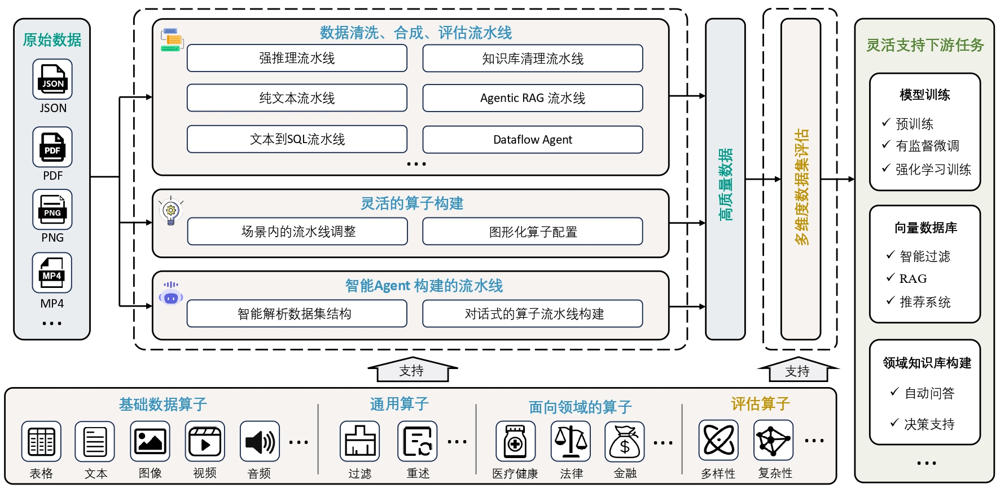

# DataFlow

<div align="center">
  

[](https://OpenDCAI.github.io/DataFlow-Doc/)
[](https://github.com/OpenDCAI/DataFlow/blob/main/LICENSE)
[](https://github.com/OpenDCAI/DataFlow)
[](https://github.com/OpenDCAI/DataFlow/issues)
[](https://github.com/OpenDCAI/DataFlow/graphs/contributors)
[](https://github.com/OpenDCAI/DataFlow)

<!-- [](https://github.com/OpenDCAI/DataFlow/commits/main/) -->

🎉 如果你认可我们的项目，欢迎在 GitHub 上点个 ⭐ Star，关注项目最新进展。

简体中文 | [English](./README.md)

**[🚀 功能介绍](#功能介绍) • [⚡ 快速开始](#快速开始) • [📖 文档](https://OpenDCAI.github.io/DataFlow-Doc/) • [🧪 实验结果](#实验结果)**

</div>

https://github.com/user-attachments/assets/3dadeeb0-7007-4cdf-b412-593af000020c](https://github.com/user-attachments/assets/9168b567-47a3-4f26-97d5-a7fa28e3ac79


## 📰 1. 最新动态

- [2025-06-28] 🎉 我们全新发布的以数据为中心的系统**DataFlow**已开源 —— 敬请关注后续更新！

## 🔍 2. 项目概述



DataFlow 是一个数据准备系统，旨在从噪声数据源（PDF、纯文本、低质量问答）中**解析，生成，加工并评估高质量数据**，以提升大语言模型（LLMs）在特定领域的表现，支持预训练、监督微调（SFT）、强化学习训练以及基于知识库的 RAG 系统。**我们在医疗、金融和法律等多个垂类领域实证验证了 DataFlow 的有效性。**

我们构建了多种基于规则、深度学习、大语言模型及其 API 的 `数据算子（Operators）`，并将其系统性地整合为多条 `数据流水线（Pipelines）`，共同组成完整的 `DataFlow 系统`。此外，我们还构建了智能的 `DataFlow-Agent`，支持按需动态编排已有算子，合成新的数据流水线。

## 🛠️ 3. 数据流程功能介绍

### 🔧 3.1 推荐使用的完整流水线

目前 DataFlow 包含以下主要数据处理流程：

- 📝 **文本处理流程（Text Pipeline）**：从大规模纯文本（多为网络爬取）中挖掘问答对，用于监督微调和强化学习训练。
  - 
  - [[HuggingFace🤗 示例数据]](https://huggingface.co/datasets/Open-Dataflow/dataflow-demo-Text)

- 🧠 **推理流程（Reasoning Pipeline）**：增强已有问答对，添加 (1) 长链式推理（Chain-of-Thought），(2) 类别标注，(3) 难度估计。
  - 
  - [[HuggingFace🤗 示例数据]](https://huggingface.co/datasets/Open-Dataflow/dataflow-demo-Reasonning)

- 🗃️ **Text2SQL 流程**：将自然语言问题转化为 SQL 查询，辅以解释、思维链推理和数据库结构上下文信息。
  - 
  - [[HuggingFace🤗 示例数据]](https://huggingface.co/datasets/Open-Dataflow/dataflow-demo-Text2SQL)

- 📚 **知识库清洗流程**：从表格、PDF 和 Word 文档等非结构化数据源中提取并整理知识，将其转化为可用于下游 RAG 或 QA 配对生成的可用条目。
  - 

- 🤖 **Agent式RAG流程**：从已有问答或知识库中挖掘需要外部知识才能作答的问答对，用于训练 Agentic RAG 模型。
  - 
    
### ⚙️ 3.2 算子自由组合的灵活流水线

在本框架中，算子可灵活组合构建数据处理流水线，按功能分为基础算子（Fundamental Operators）、通用算子（Generic Operators）、领域特定算子（Domain-Specific Operators）和评估算子（Evaluation Operators）等，覆盖从清洗到评估的多种任务。详见[项目文档](https://OpenDCAI.github.io/DataFlow-Doc/)了解具体用法。

### 🤖 3.3 Agent驱动的流水线自动编排

- **DataFlow-Agent**：智能助手，可执行数据分析、编写自定义算子，并根据任务目标自动编排算子构建数据处理流水线。
  - 
  - [[HuggingFace🤗 示例数据]](https://huggingface.co/datasets/Open-Dataflow/dataflow-demo-Agent)

## ⚡ 4. 快速开始

请使用如下命令进行环境配置和安装👇

```shell
conda create -n dataflow python=3.10 
conda activate dataflow

pip install open-dataflow
```
如果你想要用你自己的GPU完成本地推理，则需要:
```shell
pip install open-dataflow[vllm]
```
> Dataflow 支持 Python>=3.10 的环境

你可以用如下指令查看dataflow是否正确安装:
```shell
dataflow -v
```

如果安装正确，应该会看到:
```log
open-dataflow codebase version: 1.0.0
        Checking for updates...
        Local version:  1.0.0
        PyPI newest version:  1.0.0
You are using the latest version: 1.0.0.
```

### 尝试使用Gradio部署Dataflow算子

你可以使用以下命令快速启动基于 Gradio 的界面来测试 DataFlow 算子：

```bash
dataflow webui
```

该命令将启动一个交互式 Web 界面，使你能够无缝可视化所有算子。

更多使用说明和入门指南，请参考我们的 [项目文档](https://OpenDCAI.github.io/DataFlow-Doc/)。

[](https://OpenDCAI.github.io/DataFlow-Doc/)

## 🧪 5. 实验结果

如需详细的实验设置，请参考文档或论文说明。

### 📝 5.1 文本流程（Text Pipeline）

#### 5.1.1 预训练数据过滤流程

我们将 `预训练数据处理流程` 应用于从 RedPajama 数据集中随机采样的数据，最终保留率为 **13.65%**。使用 `QuratingScorer` 进行质量评估，结果如下图所示：在**写作风格、专业性要求、事实准确性和教育价值**四个维度上，过滤后的数据显著优于原始数据，验证了 DataFlow 预训练数据处理流程的有效性。

<div align="center">
  
</div>

#### 5.1.2 微调（SFT）数据过滤流程

我们从 `alpaca` 数据集中筛选了 3000 条高质量数据，与随机选取的 3000 条 `alpaca` 数据进行对比，并在 Qwen2.5-7B 模型上进行 SFT 训练。对比结果如下：

<div align="center">
  
</div>

### 🧠 5.2 推理流程（Reasoning Pipeline）

我们在 Qwen2.5-32B-Instruct 模型上，使用 Reasoning Pipeline 合成的 1000 条和 5000 条数据进行了微调训练（SFT），评估其对模型推理能力的提升，结果如下图所示：

<div align="center">
  
</div>

### 🗃️ 5.3 Text2SQL 流程

我们使用 DataFlow-Text2SQL 流程构建数据，并分别通过监督微调（SFT）与强化学习（RL）对 Qwen2.5-Coder-7B-Instruct 模型进行了训练。实验结果如下：

<div align="center">
  
</div>

## 📄 6. 发表论文

我们团队已发表以下论文，并作为构成DataFlow系统的核心组件：

| 论文标题 | DataFlow组件 | 会议 | 年份 |
|---------|-------------|:------:|------|
| [MM-Verify: Enhancing Multimodal Reasoning with Chain-of-Thought Verification](https://arxiv.org/pdf/2502.13383) | 多模态推理验证框架，用于数据处理和评估 | ACL | 2025 |
| [Efficient Pretraining Data Selection for Language Models via Multi-Actor Collaboration](https://arxiv.org/pdf/2410.08102) | 多智能体协作数据选择机制，增强数据筛选和处理能力 | ACL | 2025 |

**合作机构**: 
 
 
 
 
 


## 💐 7. 致谢
我们衷心感谢 [MinerU](https://github.com/opendatalab/MinerU) 的卓越工作，其强大的 PDF/文档文本提取功能为数据加载提供了关键支持。

## 🤝 8. 社区与支持

欢迎加入 DataFlow 开源社区，提出问题、分享想法、与其他开发者一起共建项目！

•	📮 [GitHub Issues](../../issues)：提交 Bug 或功能建议。

•	🔧 [GitHub Pull Requests](../../pulls)：贡献代码改进。

•	💬 欢迎扫码加入下方社群（微信群、小红书、Twitter），与我们和其他开发者互动交流~

<div align="center">
  
</div>

## 📜 9. 引用

如果 DataFlow 对你的研究或项目有帮助，欢迎引用支持我们：

```bibtex
@misc{dataflow2025,
  author       = {DataFlow Develop Team},
  title        = {DataFlow: A Unified Framework for Data-Centric AI},
  year         = {2025},
  howpublished = {\url{https://github.com/OpenDCAI/DataFlow}},
  note         = {Accessed: 2025-07-08}
}
```

## 📊 10. 统计信息
<div align="center">
  <a href="https://star-history.com/#OpenDCAI/DataFlow&Date">
    <picture>
      <source media="(prefers-color-scheme: dark)" srcset="https://api.star-history.com/svg?repos=OpenDCAI/DataFlow&type=Date&theme=dark" />
      <source media="(prefers-color-scheme: light)" srcset="https://api.star-history.com/svg?repos=OpenDCAI/DataFlow&type=Date" />
      
    </picture>
  </a>
  
</div>

---

<div align="center">
  <sub>
    想了解更多？欢迎关注我们
    <a href="https://zwt233.github.io/" target="_blank"><strong>PKU-DCAI 课题组</strong></a>，小红书账号：<strong>26133106768</strong>
  </sub>
</div>
