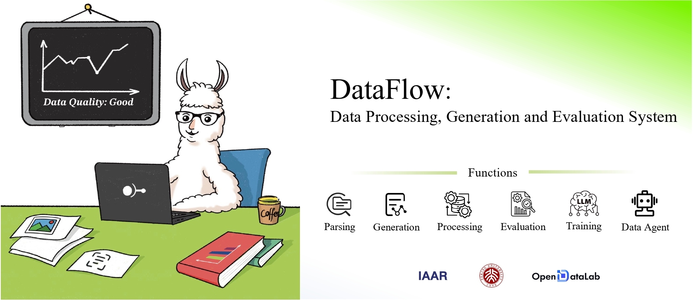
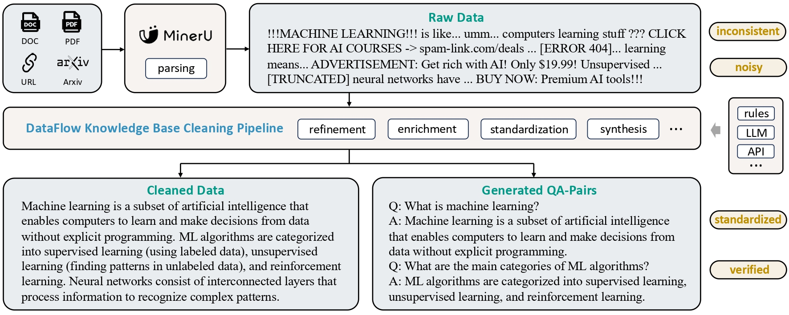
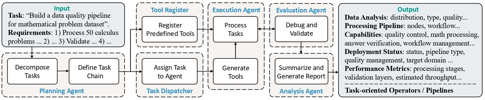
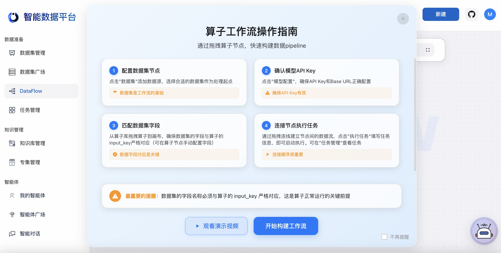
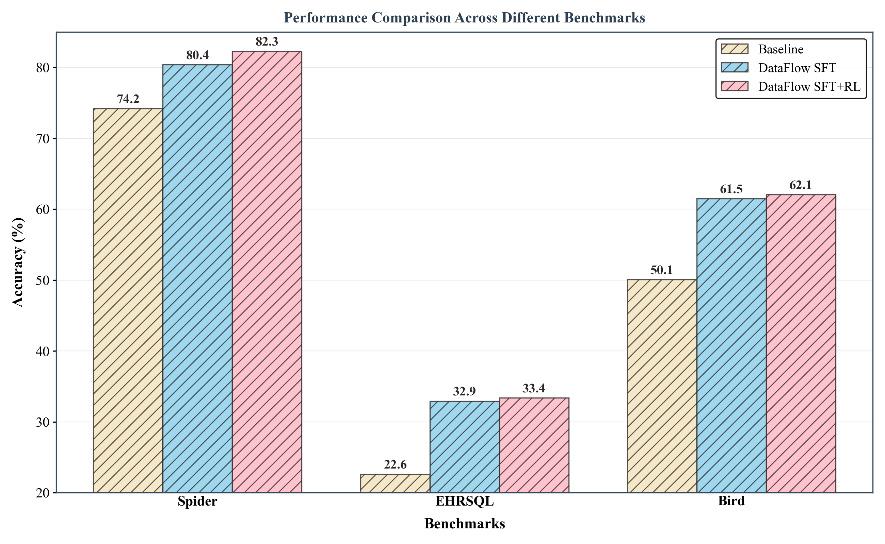

# DataFlow

<div align="center">
  


[](https://OpenDCAI.github.io/DataFlow-Doc/)
[](https://github.com/OpenDCAI/DataFlow/blob/main/LICENSE)
[](https://github.com/OpenDCAI/DataFlow)
[](https://github.com/OpenDCAI/DataFlow/graphs/contributors)
[](https://github.com/OpenDCAI/DataFlow)
[](https://deepwiki.com/OpenDCAI/DataFlow)

<!-- [](https://github.com/OpenDCAI/DataFlow/commits/main/) -->
<!--[](https://github.com/OpenDCAI/DataFlow/issues) -->
🎉 If you like our project, please give us a star ⭐ on GitHub for the latest update.

[简体中文](./README-zh.md) | English


</div>

https://github.com/user-attachments/assets/19742159-cfe0-42a6-9d3d-152466d2d588

## 📰 1. News
🎉 [2025-06-28] We’re excited to announce that DataFlow, our Data-centric AI system, is now released! Stay tuned for future updates.

## 🔍 2. Overview

  

DataFlow is a data preparation and training system designed to **parse, generate, process and evaluate** high-quality data from noisy sources (PDF, plain-text, low-quality QA), thereby improving the performance of large language models (LLMs) in specific domains through targeted training (Pre-training, Supervised Fine-tuing, RL training) or RAG using knowledge base cleaning. **DataFlow has been empirically validated to improve domain-oriented LLM's performance in fields such as healthcare, finance, and law.**

Specifically, we constructing diverse `operators` leveraging rule-based methods, deep learning models, LLMs, and LLM APIs. These operators are systematically integrated into distinct `pipelines`, collectively forming the comprehensive `DataFlow system`. Additionally, we develop an intelligent `DataFlow-agent` capable of dynamically assembling new `pipelines` by recombining existing `operators` on demand.


<!-- Text: 输入是烂数据 通过大模型 输出QA （主要是强化学习）
NL2SQL: 反向构造SQL QA
Reasonning：Question很短，构建长链COT ，是否有category，是否有难度（通过大模型）
Agentic RAG: 输入QA，出来是 QA。没有额外信息解决不了，必须要引入
Knowlege Base Cleaning: PDF，表格+doc text输入，输出是高质量知识库
Dataflow-agent: 用Agent自动合成pipeline。编排已有算子。 -->

## 🛠️ 3. Operators Functionality

### 🔧 3.1 How Operators Work

DataFlow adopts a modular operator design philosophy, building flexible data processing pipelines by combining different types of operators. As the basic unit of data processing, an operator can receive structured data input (such as in json/jsonl/csv format) and, after intelligent processing, output high-quality data results. For a detailed guide on using operators, please refer to the [Operator Documentation](https://opendcai.github.io/DataFlow-Doc/en/guide/text_evaluation_operators/ ).


### 📊 3.2 Operator Classification System

In the DataFlow framework, operators are divided into three core categories based on their functional characteristics:

| Operator Type | Quantity | Main Function |
|---|---|---|
| **Generic Operators** | 80+ | Covers general functions for text evaluation, processing, and synthesis |
| **Domain-Specific Operators** | 40+ | Specialized processing for specific domains (e.g., medical, financial, legal) |
| **Evaluation Operators** | 20+ | Comprehensively evaluates data quality from 6 dimensions |

## 🛠️ 4. Pipelines Functionality
### 🔧 4.1 Ready-to-Use PipeLines
Current Pipelines in Dataflow are as follows:
- [📝 **Text Pipeline**](https://opendcai.github.io/DataFlow-Doc/en/guide/textpipeline): Mine question-answer pairs from large-scale plain-text data (mostly crawed from InterNet) for use in SFT and RL training.
  - 
  - [[HuggingFace🤗 demo input & output for **Text Pipeline**]](https://huggingface.co/datasets/Open-Dataflow/dataflow-demo-Text)
- [🧠 **Reasoning Pipeline**](https://opendcai.github.io/DataFlow-Doc/en/guide/reasoningpipeline/#_2-question-handling): Enhances existing question–answer pairs with (1) extended chain-of-thought, (2) category classification, and (3) difficulty estimation.
  - 
  - [[HuggingFace🤗 demo input & output for **Reasoning Pipeline**]](https://huggingface.co/datasets/Open-Dataflow/dataflow-demo-Reasonning)
- [🗃️ **Text2SQL Pipeline**](https://opendcai.github.io/DataFlow-Doc/en/guide/text2sqlpipeline/): Translates natural language questions into SQL queries, supplemented with explanations, chain-of-thought reasoning, and contextual schema information.
  - 
  - [[HuggingFace🤗 demo input & output for **Text2SQL Pipeline**]](https://huggingface.co/datasets/Open-Dataflow/dataflow-demo-Text2SQL)
- [📚 **Knowlege Base Cleaning Pipeline**](https://opendcai.github.io/DataFlow-Doc/en/guide/r51ooua8/): Extract and structure knowledge from unorganized sources like tables, PDFs, and Word documents into usable entries for downstream RAG or QA pair generation.
  - 
- [🤖 **Agentic RAG Pipeline**](https://opendcai.github.io/DataFlow-Doc/en/guide/agenticrag_pipeline/): Identify and extract QA pairs from existing QA datasets or knowledge bases that require external knowledge to answer, for use in downstream training of Agnetic RAG tasks.
  - 
### ⚙️ 4.2 Flexible Operator PipeLines
In this framework, operators are categorized into Fundamental Operators, Generic Operators, Domain-Specific Operators, and Evaluation Operators, etc., supporting data processing and evaluation functionalities. Please refer to the [documentation](https://OpenDCAI.github.io/DataFlow-Doc/) for details.

### 🤖 4.3 Agent Guided Pipelines
<!-- Building on top of this, we also provide the -->
- **DataFlow Agent**: An intelligent assistant that performs data analysis, writes custom `operators`, and automatically orchestrates them into `pipelines` based on specific task objectives.

  - 
  - [[HuggingFace🤗 demo input & output for **DataFlow Agent**]](https://huggingface.co/datasets/Open-Dataflow/dataflow-demo-Agent)

<!-- ### 3.1 Text Pipeline
 -->

## ⚡ 5. Quick Start

### 🛠️ 5.1 Environment Setup and Installation

Please use the following commands for environment setup and installation👇

```shell
conda create -n dataflow python=3.10 
conda activate dataflow

pip install open-dataflow
```
If you want to use your own GPU for local inference, please use:
```shell
pip install open-dataflow[vllm]
```
> DataFlow supports Python>=3.10 environments

After installation, you can use the following command to check if dataflow has been installed correctly:

```shell
dataflow -v
```

If installed correctly, you should see:
```log
open-dataflow codebase version: 1.0.0
        Checking for updates...
        Local version:  1.0.0
        PyPI newest version:  1.0.0
You are using the latest version: 1.0.0.
```

### 🚀 5.2 Using the Gradio Web Interface

DataFlow provides two interactive web interfaces to help you use operators, pipelines, and agents:

#### 5.2.1 DataFlow Operators Interface

Launch the DataFlow operator interface to test and visualize all operators and pipelines:

```bash
dataflow webui
```

This command will start an interactive web interface, allowing you to visualize and flexibly use all operators and pipelines.

#### 5.2.2 DataFlow Agent Interface

Launch the DataFlow agent interface for operator authoring and pipeline design:

```bash
dataflow webui agent
```

This command will start the DataFlow-Agent interface, providing automated operator authoring and pipeline recommendation services.

https://github.com/user-attachments/assets/fda1ad47-a9f3-447a-b5c0-cf4c9ad64763

### 🌐 5.3 ADP Intelligent Data Platform

Beyond the local Gradio interface, **DataFlow** is also available as a fully-managed SaaS solution on the **ADP Intelligent Data Platform**.

[**ADP**](https://adp.originhub.tech) is an end-to-end system by OriginHub, designed to help enterprises accelerate the development of custom Agents and Models by integrating Large Language Models (LLMs) with private data.

#### Core Capabilities:

* 🤖 **Automated Data Preparation**: Leverage DataFlow for full-process automation of your data workflows.
* 📚 **Unified Knowledge System**: Integrate and manage large-scale, multimodal knowledge bases.
* 🤝 **Intelligent Collaboration**: Build and orchestrate powerful multi-agent systems.
* 🗄️ **AI-Native Database**: Manage the full lifecycle of your multimodal data with a purpose-built AI database.

<p align="center">
  <a href="https://adp.originhub.tech/login">
    
  </a>
</p>

#### Get Started for Free

👉 **[Sign up now to claim your free compute credits!](https://adp.originhub.tech)**

### 📖 5.4 Reference Project Documentation

For detailed **usage instructions** and **getting started guide**, please visit our [Documentation](https://OpenDCAI.github.io/DataFlow-Doc/).

## 🧪 6. Experimental Results
For Detailed Experiments setting, please visit our documentation.


### 📝 6.1 Text PipeLine

#### 6.1.1 Pre-training data filter pipeline
The `pre-training data processing pipeline` was applied to randomly sampled data from the RedPajama dataset, resulting in a final data retention rate of 13.65%. The analysis results using `QuratingScorer` are shown in the figure. As can be seen, the filtered pretraining data significantly outperforms the original data across four scoring dimensions: writing style, requirement for expert knowledge, factual content, and educational value. This demonstrates the effectiveness of the DataFlow pretraining data processing.

<div align="center">
  
</div>

#### 6.1.2 SFT data filter pipeline
We filted 3k record from `alpaca` dataset and compare it with radom selected 3k data from `alpaca` dataset by training it on Qwen2.5-7B. Results are:

<div align="center">
  
</div>

### 🧠 6.2 Reasoning Pipeline

We verify our reasoning pipeline by SFT on a Qwen2.5-32B-Instruct with Reasoning Pipeline synsthized data. We generated 1k and 5k SFT data pairs. Results are: 

<div align="center">
  
</div>

### 🗃️ 6.3 Text2SQL PipeLine
We fine-tuned the Qwen2.5-Coder-7B-Instruct model using both Supervised Fine-tuning (SFT) and Reinforcement Learning (RL), with data constructed via the DataFlow-Text2SQL Pipeline. Results are:

<div align="center">
  
</div>

## 📄 7. Publications
Our team has published the following papers that form core components of the DataFlow system:

| Paper Title | DataFlow Component | Venue | Year |
|-------------|-------------------|-------|------|
| [MM-Verify: Enhancing Multimodal Reasoning with Chain-of-Thought Verification](https://arxiv.org/pdf/2502.13383) | Multimodal reasoning verification framework for data processing and evaluation | ACL | 2025 |
| [Efficient Pretraining Data Selection for Language Models via Multi-Actor Collaboration](https://arxiv.org/pdf/2410.08102) | Multi-actor collaborative data selection mechanism for enhanced data filtering and processing | ACL | 2025 |

**Contributing Institutions**: 
 
 
 
 
 


## 💐 8. Acknowledgements
We sincerely appreciate [MinerU](https://github.com/opendatalab/MinerU)'s outstanding contribution, particularly its robust text extraction capabilities from PDFs and documents, which greatly facilitates data loading.

## 🤝 9. Community & Support
Join the DataFlow open-source community to ask questions, share ideas, and collaborate with other developers!

•	📮 [GitHub Issues](../../issues): Report bugs or suggest features
 
•	🔧 [GitHub Pull Requests](../../pulls): Contribute code improvements

•	💬 Join our community groups to connect with us and other contributors!
 
<div align="center">
  
</div>

## 📜 10. Citation
If you use DataFlow in your research, feel free to give us a cite.
```bibtex
@misc{dataflow2025,
  author       = {DataFlow Develop Team},
  title        = {DataFlow: A Unified Framework for Data-Centric AI},
  year         = {2025},
  howpublished = {\url{https://github.com/OpenDCAI/DataFlow}},
  note         = {Accessed: 2025-07-08}
}
```

## 📊 11. Statistics
<div align="center">
  <a href="https://star-history.com/#OpenDCAI/DataFlow&Date">
    <picture>
      <source media="(prefers-color-scheme: dark)" srcset="https://api.star-history.com/svg?repos=OpenDCAI/DataFlow&type=Date&theme=dark" />
      <source media="(prefers-color-scheme: light)" srcset="https://api.star-history.com/svg?repos=OpenDCAI/DataFlow&type=Date" />
      
    </picture>
  </a>
  
</div>

---
<div align="center">
  <sub>
    Connect with the 
    <a href="https://zwt233.github.io/" target="_blank"><strong>PKU-DCAI Research Team</strong></a> 
    on Xiaohongshu: <strong>26133106768</strong>
  </sub>
</div>
